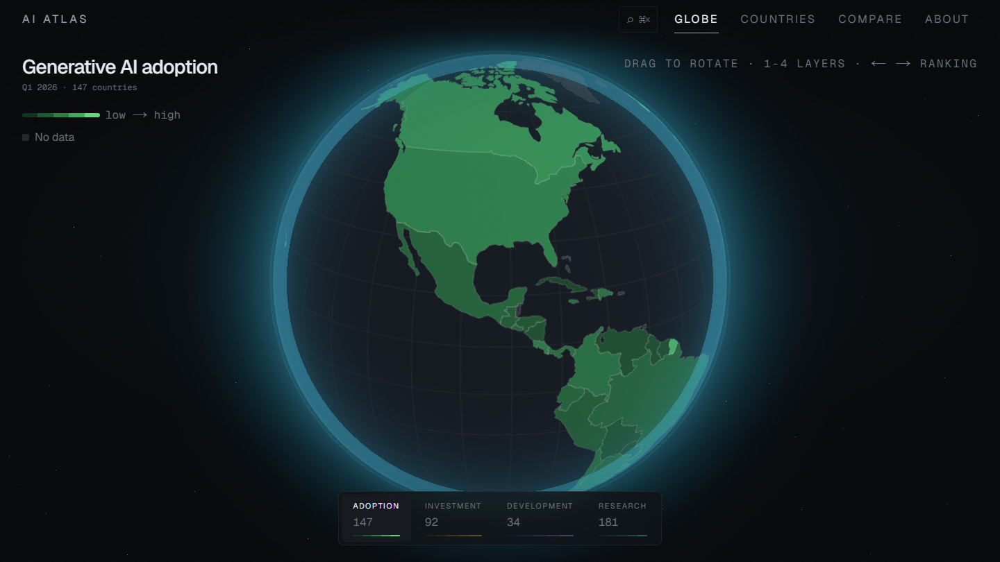
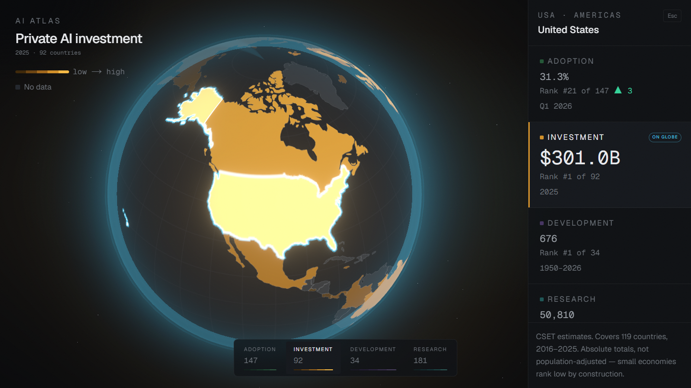
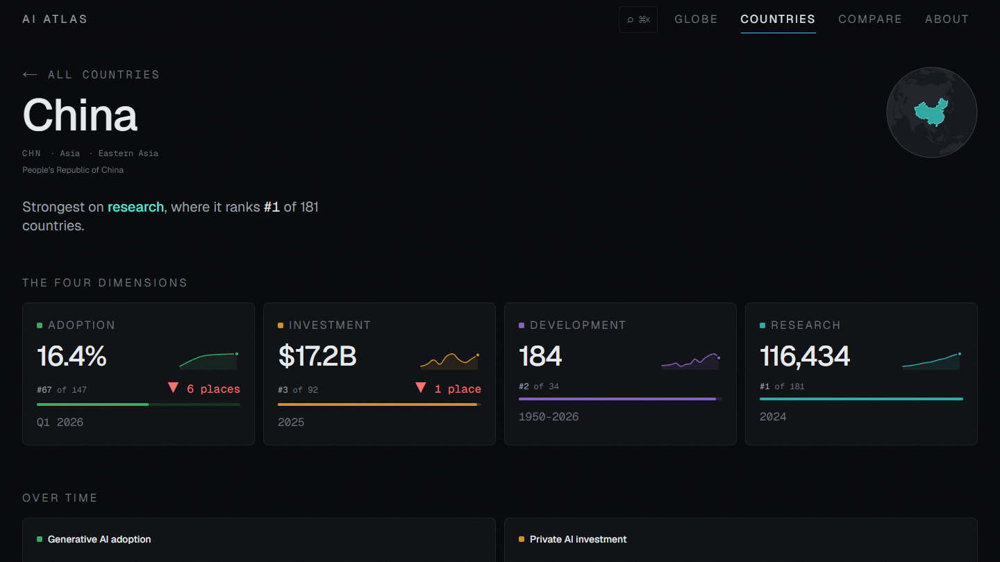
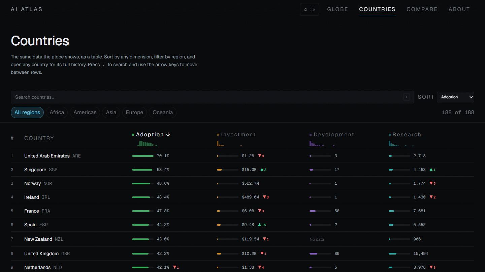
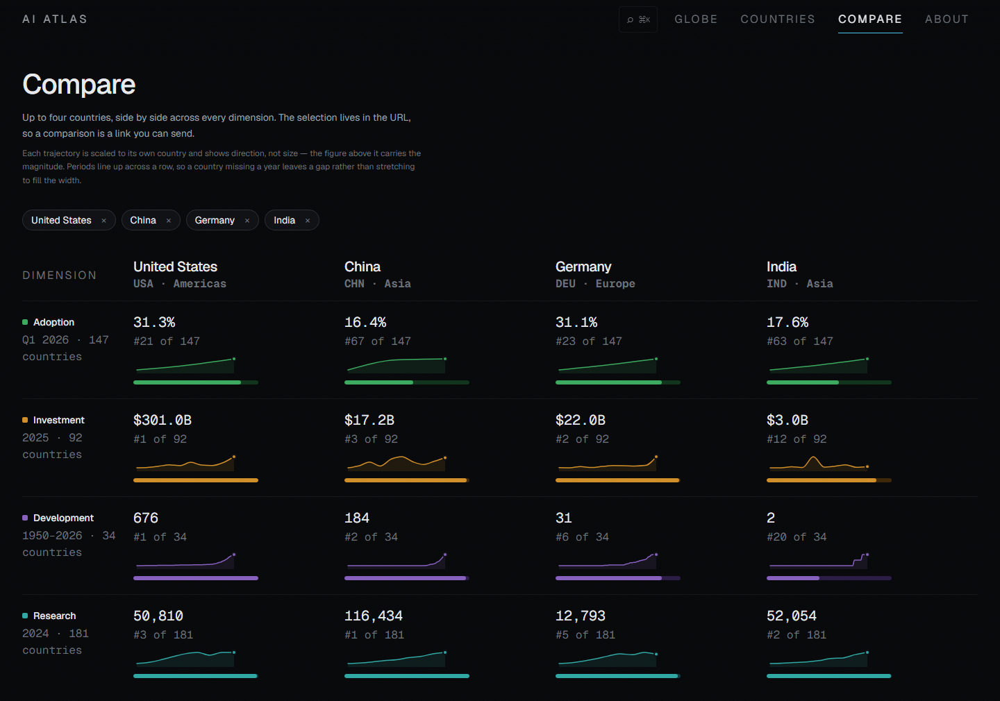
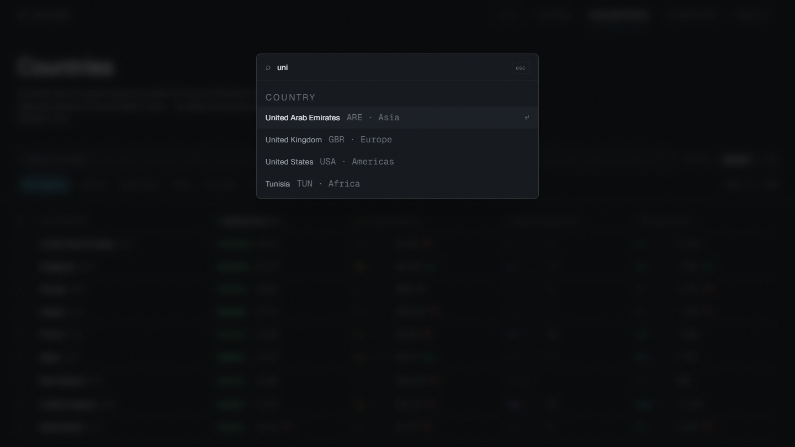

<div align="center">

# AI Atlas

**The global AI race, visualized.**

An interactive intelligence platform where a WebGL globe is the primary navigation
surface — backed by a real ETL pipeline into Postgres, not a folder of JSON fixtures.



</div>

---

## What this is

Four dimensions of the global AI landscape — **adoption**, **investment**, **development**
and **research** — across 194 countries. Every figure on screen traces back to a row in a
database, which traces back to a dated snapshot of a published dataset.

There is no "overall AI score." Countries lead on different dimensions, and collapsing
that into one number would be inventing a finding rather than showing one.

```
194 countries with data  ·  3,419 metric rows  ·  3,419 rankings  ·  1,052 models
```

---

## Inside

<table>
<tr>
<td width="50%"></td>
<td width="50%"></td>
</tr>
<tr>
<td><b>The globe</b> — click a country and the camera flies to it, the globe slides clear of the panel, and every layer's figure appears with its rank and movement. Switching layers crossfades the whole sphere to a new palette.</td>
<td><b>Country pages</b> — 194 of them, statically generated. The hero names the dimension that country actually leads on. Four metrics, their full history, and every notable AI model built there.</td>
</tr>
<tr>
<td></td>
<td></td>
</tr>
<tr>
<td><b>The ranked index</b> — the same data as a table, sortable by any dimension and filterable by region. The globe is not the only route to the data, which is why this is a requirement rather than a nice-to-have.</td>
<td><b>Compare</b> — up to four countries at once. Bars are percentile <i>within each dimension</i>, the only scale on which a share of adults, a sum in dollars and a count of papers honestly sit together.</td>
</tr>
</table>

<div align="center">

<br>
<sub><b>⌘K from anywhere</b> — every country, layer and page. 194 entries in under 10 KB, searched entirely on the client.</sub>
</div>

---

## The data

Four layers, all country-level, all verified against source before a line of UI was
written. Coverage is the number of distinct countries each dataset carries.

| Layer           | Source                                               | Countries | Period            |
| --------------- | ---------------------------------------------------- | --------- | ----------------- |
| **Adoption**    | Microsoft AI Diffusion Report, via Our World in Data | 147       | Q2 2025 – Q1 2026 |
| **Investment**  | CSET, via Our World in Data                          | 119       | 2016 – 2025       |
| **Research**    | CSET / Stanford AI Index, via Our World in Data      | 190       | 2016 – 2024       |
| **Development** | Epoch AI — Notable AI Models                         | 34        | 1950 – 2026       |

The **development** layer covers only 34 countries, and the United States alone accounts
for 676 of the 1,052 notable models. That concentration _is_ the finding — the map is
mostly empty because the world mostly is. `--no-data` is a designed state with its own
colour token and a permanent place in the legend, never a zero and never interpolated.

<details>
<summary><b>Provenance and licences</b></summary>

| Source                                                                            | Licence       | Notes                                                              |
| --------------------------------------------------------------------------------- | ------------- | ------------------------------------------------------------------ |
| [Our World in Data](https://ourworldindata.org)                                   | CC BY 4.0     | Adoption, investment and research layers                           |
| [Microsoft AI Diffusion Report](https://github.com/microsoft/ai-diffusion-report) | MIT           | Source of record for adoption; OWID republishes it with ISO3 codes |
| [Epoch AI](https://epoch.ai/data/notable-ai-models)                               | CC BY         | Notable models, organisation and country                           |
| [Stanford AI Index](https://hai.stanford.edu/ai-index)                            | CC BY-ND      | Methodology and framing                                            |
| [world-atlas](https://github.com/topojson/world-atlas)                            | Public domain | Natural Earth country geometry                                     |

Every fetched CSV is committed to `data/snapshots/` with its retrieval date, so
`pnpm ingest -- --offline` rebuilds the entire database with no network access — and the
exact bytes behind any published figure stay in version control.

</details>

---

## Architecture

The decisions worth explaining.

**Metrics are stored tall, not wide.** `metrics(country_iso3, metric_key, period, value)`,
with metric metadata in a separate table the app reads at runtime. Adding a fifth globe
layer is a row in `metric_defs` plus an ingest source: no migration, no component change,
no redeploy of the layer switcher.

**The globe is one textured sphere, not 177 country meshes.** The choropleth is painted
into a 2048×1024 canvas and mapped on, so the sphere is a single draw call and a layer
switch is a GPU crossfade between two textures. Picking runs on the CPU through
`d3-geo`'s point-in-polygon with a bounding-box prefilter — exact, and no ID-buffer
readback. That leaves the entire GPU budget for atmosphere, bloom and starfield.

**The globe never rotates; the camera orbits.** World space and globe space stay
identical, so a raycast hit converts straight to latitude and longitude with no rotation
to unwind.

**Charts are hand-built React and SVG on d3 scales.** No chart library. Each plot carries
a single series and therefore no legend — the four layers have incompatible units, and a
shared axis would need a second y-scale whose alignment is arbitrary, inventing a
correlation that is not in the data.

**Rankings are precomputed at ingest.** Rank, previous rank, delta and percentile are
written during the pipeline run, so rank-change animations cost an indexed lookup rather
than a window function per request.

**Ingest fails loudly.** An unresolved country name or a vanished upstream column exits
non-zero naming the file to edit. Aggregates like `World` and `Multinational` are declared
explicitly and filtered _before_ resolution, so a genuine miss is never mistaken for an
expected skip. A quietly shrinking map looks completely fine until someone checks.

**Country pages are static with ISR.** 194 pages built in about 40 seconds; the database
is off the critical render path. Layer payloads reach the client as
`[iso3, value, rank, delta]` tuples — roughly 3 KB per layer instead of 40.

> The full decision log, including two data-quality traps found during ingest, is in
> [`docs/DECISIONS.md`](docs/DECISIONS.md).

---

## Stack

|               |                                                                                |
| ------------- | ------------------------------------------------------------------------------ |
| **Framework** | Next.js 16 (App Router, RSC) · React 19 · TypeScript strict                    |
| **3D**        | three.js · React Three Fiber · drei · postprocessing · custom GLSL             |
| **Styling**   | Tailwind CSS v4 · design tokens in one CSS file                                |
| **Motion**    | Motion · custom camera damping · `prefers-reduced-motion` throughout           |
| **Data viz**  | d3 modules (`scale`, `geo`, `shape`, `interpolate`) — charts hand-built in SVG |
| **State**     | Zustand · nuqs for URL-synced view state                                       |
| **Backend**   | Neon serverless Postgres · Drizzle ORM                                         |
| **Testing**   | Vitest · Playwright                                                            |

`noUncheckedIndexedAccess` is on. This project parses a lot of CSV, and it forces every
indexed read to be checked rather than trusted.

---

## Running it

**Requirements:** Node 20+, pnpm, and a Postgres connection string
([Neon](https://neon.tech) has a free tier).

```bash
pnpm install
cp .env.example .env.local          # add DATABASE_URL (use the pooled endpoint)

pnpm db:migrate                     # create the schema
pnpm ingest                         # fetch, validate, resolve, upsert
pnpm ingest:report                  # verify what landed

pnpm dev                            # http://localhost:3000
```

Deploying is covered in [`docs/DEPLOYMENT.md`](docs/DEPLOYMENT.md).

`pnpm ingest:report` runs hard integrity checks against figures verified by hand at the
source. If the United Arab Emirates is not 70.1% at Q1 2026, the pipeline is wrong no
matter how healthy the row counts look.

### Commands

| Command                                         |                                                      |
| ----------------------------------------------- | ---------------------------------------------------- |
| `pnpm dev` · `pnpm build`                       | Dev server (Turbopack) · production build            |
| `pnpm typecheck`                                | `next typegen && tsc --noEmit` — typegen is required |
| `pnpm lint` · `pnpm format`                     | ESLint · Prettier                                    |
| `pnpm test`                                     | Vitest                                               |
| `pnpm ingest`                                   | Full pipeline into Postgres                          |
| `pnpm ingest -- --dry-run`                      | Fetch and resolve, write nothing                     |
| `pnpm ingest -- --offline`                      | Rebuild from committed snapshots, no network         |
| `pnpm ingest:crosswalk`                         | Regenerate the country crosswalk                     |
| `pnpm ingest:discover -- "terms"`               | Find country-level OWID charts — never guess a slug  |
| `pnpm db:generate` · `db:migrate` · `db:studio` | Drizzle                                              |
| `pnpm analyze`                                  | Bundle analyzer                                      |

---

## Interaction

**⌘K** or **Ctrl-K** anywhere searches every country, layer and page.

| On the globe       |                                                                   |
| ------------------ | ----------------------------------------------------------------- |
| **Drag**           | Rotate. Idle rotation resumes after twelve seconds of quiet.      |
| **Hover**          | Country, value and rank.                                          |
| **Click**          | Fly to the country and open its detail panel.                     |
| **`1`–`4`**        | Switch layer.                                                     |
| **`←` `→`**        | Walk the ranking, camera following. Hold to tour the leaderboard. |
| **`Home` / `End`** | Jump to best / worst rank.                                        |
| **`Esc`**          | Close the panel.                                                  |

| In the country table |                   |
| -------------------- | ----------------- |
| **`/`**              | Focus search      |
| **`↑` `↓`**          | Move between rows |

Every view is a link: `/?layer=investment&country=BRA` ·
`/compare?countries=USA,CHN,DEU`.

---

## Project layout

```
src/
  app/
    page.tsx                the globe; static + ISR
    countries/              ranked index and 194 country pages
    compare/                percentile comparison
    about/                  the case study
  components/
    globe/                  R3F scene, camera rig, HUD, shaders
    charts/                 mark specs, time series, sparkline, bars
    panels/                 metric tiles, country table, compare board
    ui/                     nav, command palette, animated figures
  lib/
    db/                     Drizzle schema, client, queries
    geo/                    crosswalk, sphere maths, choropleth painter
    metrics/                registry, colour scales, formatters
  styles/tokens.css         every colour, duration and type step
scripts/ingest/             fetch -> validate -> resolve -> upsert
data/snapshots/             dated source CSVs, committed
docs/                       MASTER_PLAN.md, DECISIONS.md
```

Colour lives in exactly one file. Nothing outside `tokens.css` hard-codes a hex.

---

## Status

The globe, country pages, the ranked index, compare, search and the case-study page are
built, along with sitemap, robots, per-country social images, and error and loading
states. 55 tests; a production build of 205 pages takes about a minute.

**Two things are deliberately unbuilt.** A "fastest rising" view is on hold: the adoption
estimates are modelled, and low-data countries are imputed in regional blocks — twelve
West African countries share exactly 10.1%. Rank movement inside such a block is an
artefact of the model, not a national trend, so the feature needs an honest answer before
it ships. Company profiles are also outstanding; there is no free funding API worth
trusting, so they will be hand-curated and labelled as such.

The reasoning for both is written down in [`docs/DECISIONS.md`](docs/DECISIONS.md) rather
than discovered later.

---

<div align="center">
<sub>Data from Our World in Data, Microsoft, Epoch AI and Stanford HAI, under their
respective licences. Built with Next.js and three.js.</sub>
</div>
